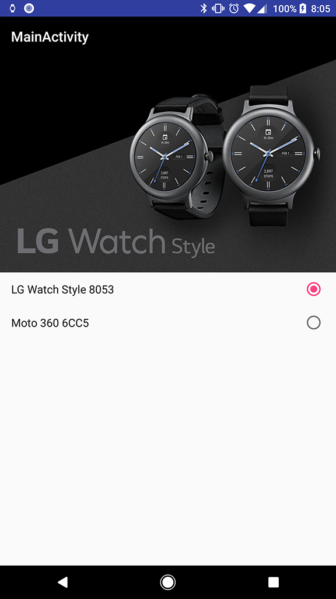
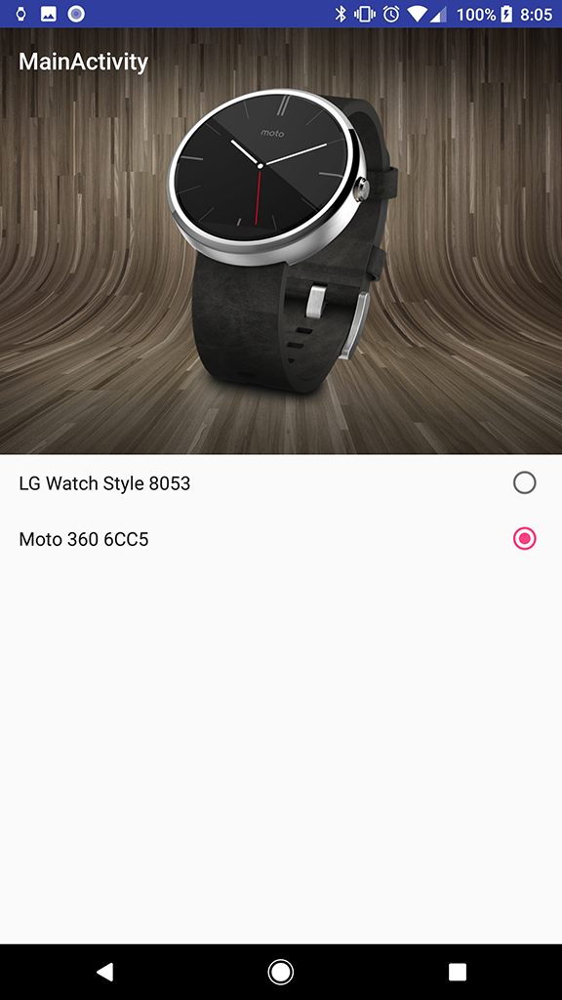

WearHeroHelper
=======
[  ](https://bintray.com/gaelan-bolger/maven/day.cloudy.apps.wear-herohelper-common/_latestVersion)

Android library for displaying a wearable's hero image on a companion device.
For more information check out [this Medium article][1] I wrote.





Include
--------

Wear Module
```groovy
repositories {
    maven {
        url "http://dl.bintray.com/gaelan-bolger/maven"
    }
}
dependencies {
	compile 'day.cloudy.apps:wear-herohelper-common:0.0.1'
	compile 'day.cloudy.apps:wear-herohelper-wearable:0.0.1'
}
```

Mobile Module
```groovy
repositories {
    maven {
        url "http://dl.bintray.com/gaelan-bolger/maven"
    }
}
dependencies {
	compile 'day.cloudy.apps:wear-herohelper-common:0.0.1'
	compile 'day.cloudy.apps:wear-herohelper-companion:0.0.1'
}
```


Example
--------
	
Wear Module
```java
	// Put the hero image data so that the companion can access it,
	// no-op if the data item already exists so safe to call every app start
	HeroImageHelper.putHeroImageDataItem(this);
```

Mobile Module
```java
	// Load the hero image into an image view, utilizes a transition drawable
	Drawable fallback = ContextCompat.getDrawable(this, R.drawable.default_hero);
	HeroImageLoader.load(mGoogleApiClient, node.getId()).fallback(fallback).into(mHeroImage);
```

Advanced
--------

See the sample app for advanced usage including listening for changes in the companion app and switching between wearable devices.
		
License
--------

    Copyright 2017 Gaelan Bolger

    Licensed under the Apache License, Version 2.0 (the "License");
    you may not use this file except in compliance with the License.
    You may obtain a copy of the License at

       http://www.apache.org/licenses/LICENSE-2.0

    Unless required by applicable law or agreed to in writing, software
    distributed under the License is distributed on an "AS IS" BASIS,
    WITHOUT WARRANTIES OR CONDITIONS OF ANY KIND, either express or implied.
    See the License for the specific language governing permissions and
    limitations under the License.
	
 [1]: https://medium.com/@bolger.g/android-wear-hero-e12a45a954fa
